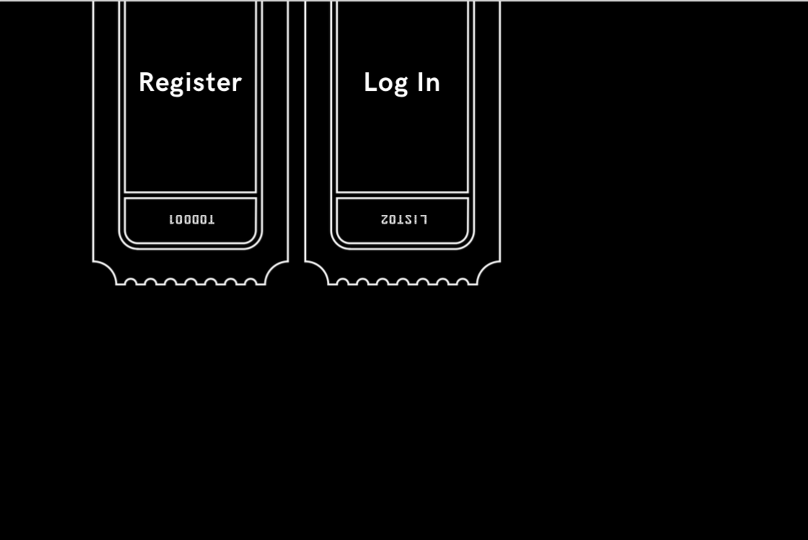
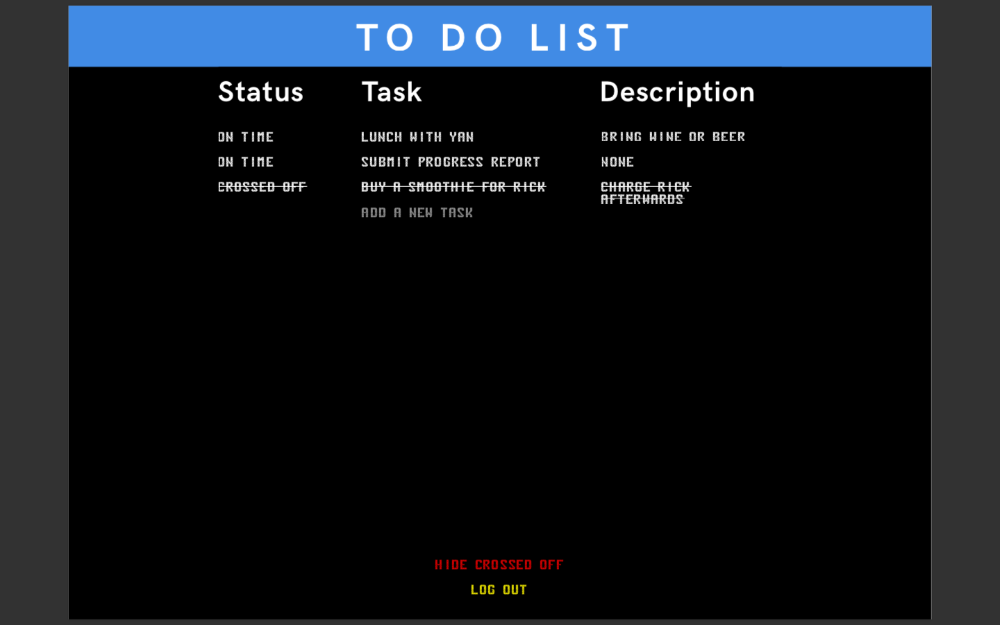

# Task Manager App

This is an app for keeping track of things you need to do. Add pending tasks to the list and cross tasks off when they're done. 

## Contributors

This was a collaboration between [Andrew Kazinec](https://www.linkedin.com/in/andrewkazinec/) and [Mimi Klein](http://mimiklein.me/). The designs and design concept was crafted into detailed mockups by Andrew, and developed by Mimi. 

## Deployed At

https://do-all-the-things.herokuapp.com/

## Technologies Used

- Node/Express
- PostgreSQL
- React
- React-Router
- Bcrypt
- JSON Web Token
- Concurrently
- Axios

## Designs

